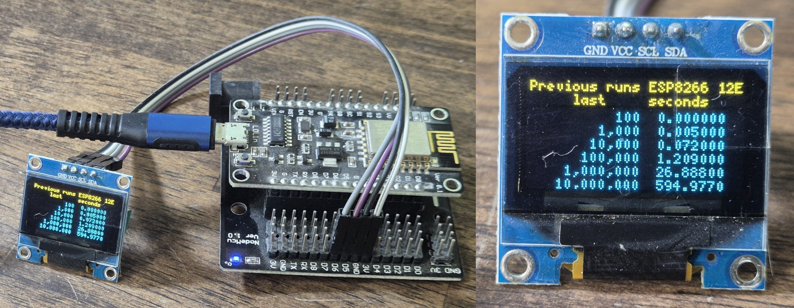
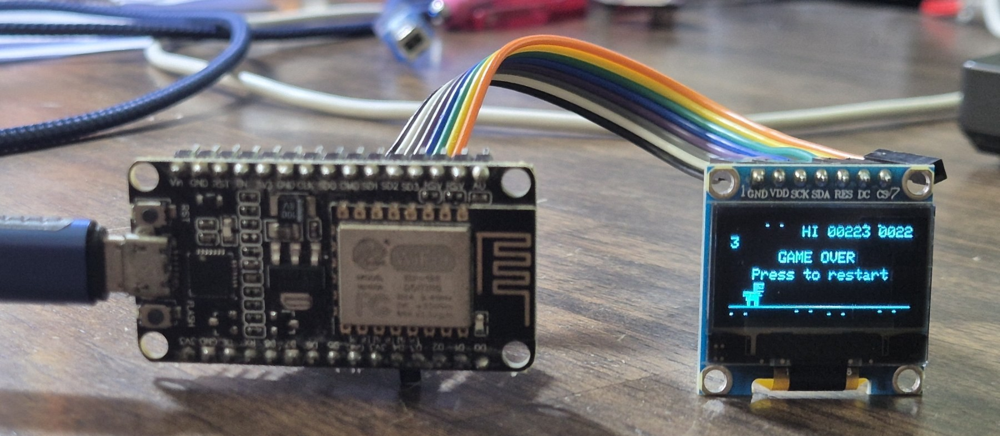
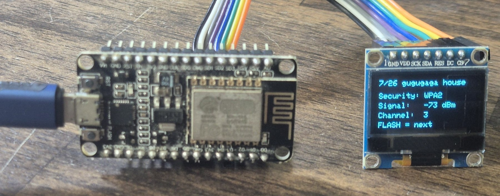
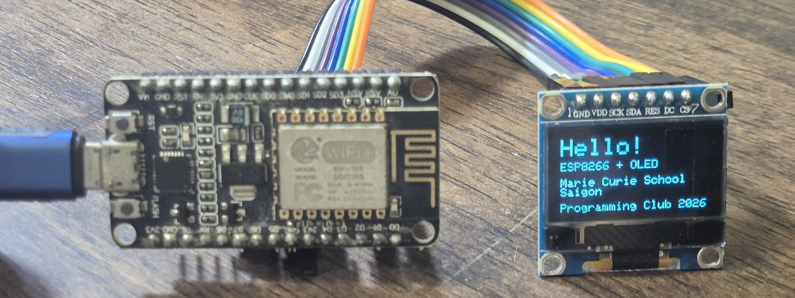

# esp8266


Projects with the ESP8266.

## OLED over I2C and SH1106 driver

See more examples in [this folder](./oled_128x64_SH1106/)



## OLED over SPI and SSD1306 driver

Much faster so suitable for games like Dino Jump, see more in [this folder](./oled_128x64_SSD1306_SPI/).

### Jumping Dino



### Wifi Scanner



### Hello at Marie Curie School



## Example program

The Prime Number program got longer over the time:

``` cpp
// Prime numbers in Arduino C v5.6 2023/12/22 for ESP8266-12E with SH1106 oled
// Wemos ESP8266 1.14" 128x64 OLED display
// 2023-12-22 Code
// 2024-01-04 One button as input 
// 2026-10-05 Selector (long press) and calculation trigger added 
// Inspired by https://github.com/kreier/ESP8266/blob/main/oled_128x64/prime_u8g2/prime_u8g2.ino
// https://github.com/marie-curie-stem/esp8266/edit/main/oled_128x64_SH1106/oled_prime_v5-6/oled_prime_v5-6.ino

#include <U8g2lib.h>
#include <Wire.h>
#include <math.h>
#include <ESP_EEPROM.h>

U8G2_SH1106_128X64_NONAME_F_SW_I2C  u8g2(U8G2_R0, 12, 14); // wide Lolin ESP8266 board
// U8G2_SSD1306_128X64_NONAME_F_SW_I2C u8g2(U8G2_R0, 4, 5);   // integrated board

#define FONT7     u8g2_font_5x7_mf
// #define FONT7     u8g2_font_resoledmedium_tr
#define FONT10    u8g2_font_6x10_mf
#define PROFONT17 u8g2_font_profont17_mf

int buttonDOWN = 12;
int buttonUP   = 13;
int buttonOK   = 0;           // 14 for shield
int led        = LED_BUILTIN; // LED_BUILTIN

double start;
long primes_found     = 4;   // we already know 2, 3, 5, 7
int  divisors  = primes_found;
uint16_t primes[6550]  = {3, 5, 7}; // prime #671 is 5009 > sqrt(25 million)
const uint32_t scope[] = {100, 1000, 10000, 100000, 1000000, 10000000, 25000000, 100000000, 1000000000, 2147483647, 4294967295};
const long reference[] = {25, 168, 1229, 9592, 78498, 664579, 1565927, 5761455, 50847534, 105097565, 203280221};
const char* label[]    = {"100", "1,000", "10,000", "100,000", "1,000,000", "10,000,000", "25,000,000", "100,000,000", "1,000,000,000", "2,147,483,647", "4,294,967,295"};

enum State { SHOW_RESULTS, SELECT_SCOPE, CALCULATING, DONE };
State state = SHOW_RESULTS;
int scopeIndex = 0;

void setup() {
  Serial.begin(74880); // ESP8266 boot ROM rate: set the serial monitor to 74880 baud to read boot messages and crash dumps
  u8g2.begin();
  pinMode(led, OUTPUT);
  pinMode(buttonOK, INPUT_PULLUP);
  splash();
}

void loop() {                        // little state machine
  switch (state) {
    case SHOW_RESULTS:
      select_option(6, show_last_results);
      state = SELECT_SCOPE;
      break;
    case SELECT_SCOPE:
      scopeIndex = select_option(11, show_scope);
      state = CALCULATING;
      break;
    case CALCULATING:
      run_calculation(scopeIndex);
      state = DONE;
      break;
    case DONE:
    if (digitalRead(buttonOK) == 0) {
      while (digitalRead(buttonOK) == 0) delay(10);
      state = SHOW_RESULTS;
    }
    delay(10);
    break;
  }
}

/* Functions in this program:

State machine (in loop):
  SHOW_RESULTS -> SELECT_SCOPE -> CALCULATING -> DONE -> SHOW_RESULTS ...

User interface:
  splash()                    Start screen, 2 s animation, previous results on Serial
  select_option(count, fn)    Button menu: short press = next, long press (>=500 ms) = confirm
  show_last_results(int)      Draws the 6-row table of previous run times from EEPROM
  show_scope(int)             Draws the "Primes to ..." selector screen
  show_progress(num, col, l)  OLED and Serial update every 1.234 s, blinks the LED
  show_final(int, float)      Final result on the OLED: count, OK/WRONG, duration

Calculation:
  run_calculation(int)        Runs one complete measurement for the selected range
  prepare_divisors(last)      Calculates sqrt(last) and fills primes[] up to it
  find_primes(limit)          Builds the divisor table with is_prime()
  is_prime(long)              Trial division by odd numbers (slow, only for the divisor table)
  is_prime_fast(uint32_t)     Checks a number against the primes[] table

Output and storage:
  report_result(int, float)   Count, reference and duration on Serial
  save_result(int, float)     Writes the duration as float to EEPROM (4 bytes per range)
  elapsed_time(long)          Prints seconds as h/min/s on Serial
*/

int select_option(int count, void (*draw_fn)(int)) {
  int index = 0;
  u8g2.clearBuffer(); draw_fn(index); u8g2.sendBuffer();
  while (true) {
    if (digitalRead(buttonOK) == 0) {
      uint32_t pressed = millis();
      while (digitalRead(buttonOK) == 0) delay(10);
      if (millis() - pressed >= 500) return index;   // long press = confirm
      index = (index + 1) % count;                   // short press = next
      u8g2.clearBuffer(); draw_fn(index); u8g2.sendBuffer();
    }
    delay(10);
  }
}

void run_calculation(int index) {
  // start calculating in micros for higher precision for the first 7 calculations
  // changed to millis since after 71 minutes there is a rollover
  uint32_t last = scope[index];
  primes_found = 4;   // we already know 2, 3, 5, 7
  Serial.println("\n\nPrime v5.6");
  Serial.print("Primes until ");
  Serial.println(label[index]);
  u8g2.setFont(FONT10);
  u8g2.drawStr(15, 50, "Now calculating");
  u8g2.drawStr(15, 62, "prime factors.");
  u8g2.sendBuffer();
  float last100 = last / 100.0;
  
  start = millis();
  uint16_t largest_divider = prepare_divisors(last);

  double dot = millis();
  int column = 0;
  bool first_update = true;  
  for(uint32_t number = largest_divider + 2; number < last; number += 2)
  {
    primes_found += is_prime_fast(number);
    if ((millis() - dot) > 1234) {
      if (first_update) {            // replace "Now calculating" only now
        u8g2.clearBuffer();
        show_scope(index);
        first_update = false;
      }      
      column = show_progress(number, column, last100);
      dot = millis();
    }
  }
  if (last & 1) primes_found += is_prime_fast(last);   // the loop stops at last when it is odd
  const float duration = (millis() - start)/1000;
  if(duration > 2) {
    Serial.print("\n");
  }

  report_result(index, duration);
  save_result(index, duration);
  show_final(index, duration);
  digitalWrite(led, HIGH);   // LED off (it is active-low)  
}

int is_prime(long number) {
  int prime = 1;
  for (long divider = 3; divider < (long)(sqrt(number)) + 1; divider += 2) {
    if (number % divider == 0) {
      prime = 0;
      break;
    }
  }
  return prime;
}

void find_primes(long limit) {
  int column = 0;
  Serial.print("Finding primes to limit of ");
  Serial.println(limit);
  for(long number=11; number < limit + 1; number += 2) { 
    if( is_prime(number) == 1) {
      primes[primes_found - 1] = number;
      primes_found++;
    }
    // if(number > 21700) {
    if((number + 1) % 100 == 0) {
      Serial.print(" ");
      Serial.print(number);
      delay(1);
      // Serial.print(".");
      column += 1;
      if(column > 15) {
        column = 0;
        Serial.print("\n");
      }
    }
  }
  primes[primes_found - 1] = limit;
  divisors = primes_found - 1;
  Serial.print("\n");
  // return 1;
}

int is_prime_fast(uint32_t number) {
  for (int i = 0; i < divisors; i++) {
    uint32_t p = primes[i];
    if (p * p > number) return 1;     // p*p <= 4,294,836,225 still fits in uint32_t
    if (number % p == 0) return 0;
  }
  return 1;
  /* my old algorithm
  long largest_divider = (long)(sqrt(number));
  int flag_prime = 1;
  for(int i=0; i < divisors; i++) {
    if(number % primes[i] == 0) {
      flag_prime = 0;
      break;
    }
    if(primes[i] > largest_divider) {
      break;
    }
  }
  return flag_prime;
  */
}

void elapsed_time(long seconds) {
  int hours = (int)seconds/3600;
  int minutes = (int)(seconds/60 - hours*60);
  int sec = (int)(seconds - minutes*60 - hours*3600);
  Serial.print(" ");
  Serial.print(hours);
  Serial.print("h ");
  Serial.print(minutes);
  Serial.print("min ");
  Serial.print(sec);
  Serial.print("s ");
}

void show_last_results(int startvalue) {
  u8g2.clearBuffer();
  u8g2.setFont(FONT7);
  u8g2.drawStr(0, 8, "Previous runs ESP8266 12E");
  u8g2.drawStr(0, 16, "     last     seconds");
  int digits = 6;
  for(int i = 0; i < 6; i++) {
    int spaces = 13 - strlen(label[i + startvalue]);
    u8g2.setCursor(spaces * 5, 24 + 8 * i);
    u8g2.print(label[i + startvalue]);
    u8g2.print("  ");
    float last_time;
    EEPROM.get((i  + startvalue) * 4 + 1, last_time);
    if(last_time > 9.9) {
      digits = 6 - (int)log10(last_time);
    }
    else {
      digits = 6;
    }
    u8g2.print(String(last_time, digits));
  }  
}

void show_scope(int index) {
  u8g2.setFont(PROFONT17);
  u8g2.drawStr(20, 16, "Primes to");
  u8g2.setCursor(5, 32);
  u8g2.print(label[index]);
  u8g2.print("           ");
}

void splash() {
  u8g2.clearBuffer();
  digitalWrite(led, LOW);

  // delay start by 2 seconds with animation and serial output
  u8g2.setFont(PROFONT17);
  u8g2.drawStr(20, 40, "Primes");
  for (int i = 0; i < 2; i++) {
    Serial.print(".");
    u8g2.drawStr(80+10*i, 40, ".");
    u8g2.sendBuffer();
    delay(1000);
  }
  digitalWrite(led, HIGH);  
  
  // previous runs written on serial
  EEPROM.begin(48);
  Serial.print("\n\nEEPROM already used to ");
  Serial.print(EEPROM.percentUsed());
  Serial.print("%\n");

  Serial.print("\nPrevious results ESP8266 12E:\n");
  Serial.print("    last        seconds   \n");
  int digits = 6;
  for(int i = 0; i < 11; i++) {
    int spaces = 13 - strlen(label[i]);
    for(int j = 0; j < spaces; j++) {
      Serial.print(" ");
    }
    Serial.print(label[i]);
    Serial.print("    ");
    float last_time;
    EEPROM.get((i) * 4 + 1, last_time);
    Serial.print(last_time, 6);
    Serial.print("\n");
  }
}

uint16_t prepare_divisors(uint32_t last) {             // the sqrt, the odd adjustment and find_primes
  uint16_t largest_divider = (sqrt(last)); 
  if(largest_divider % 2 == 0) largest_divider += 1;
  find_primes(largest_divider);
  Serial.print("found ");
  Serial.print(primes_found);
  Serial.print(" primes until ");
  Serial.print(largest_divider);
  Serial.print(" to use as divisors.\n");
  return largest_divider;
}

int show_progress(uint32_t number, int column, float last100) {        // the OLED and Serial update every 1.234 s
  Serial.print(".");
  column += 1;
  if(column % 2 == 0) {
    digitalWrite(led, HIGH);
  }
  else
  {
    digitalWrite(led, LOW);
  }
  u8g2.setFont(FONT10);
  u8g2.setCursor(0, 44);
  u8g2.print(number);
  u8g2.print(" - ");
  u8g2.print(number / last100);
  u8g2.println("%   ");
  float elapsed_seconds = (millis() - start)/1000;
  u8g2.setCursor(0, 54);
  u8g2.print(String(elapsed_seconds, 3));
  u8g2.println(" seconds ");
  int hours = (int)elapsed_seconds/3600;
  int minutes = (int)(elapsed_seconds/60 - hours*60);
  u8g2.setCursor(0, 64);
  u8g2.print(hours);
  u8g2.print("h ");
  u8g2.print(minutes);
  u8g2.print("min ");
  u8g2.sendBuffer();
  if(column > 40) {
    column = 0;
    elapsed_time(elapsed_seconds);
    Serial.print(" - ");
    Serial.print(number);
    Serial.print(" ");
    Serial.print(number / last100);
    Serial.print("% \n");
  }
  return column;
}

void report_result(int index, float duration) {
  Serial.print("Found ");
  Serial.print(primes_found);
  Serial.print(" prime numbers. It should be ");
  Serial.print(reference[index]);
  Serial.print(".\nThis took ");
  Serial.print(duration, 3);
  Serial.print(" seconds. ");
  elapsed_time(duration);
}

void save_result(int index,float duration) {
  EEPROM.put(index * 4 + 1, duration);
  boolean ok1 = EEPROM.commit();
  Serial.println((ok1) ? "- OK" : "Commit failed");
  Serial.print("\n");
}

void show_final(int index, float duration) {
  u8g2.clearBuffer();
  show_scope(index);
  u8g2.setFont(FONT10);
  u8g2.setCursor(0, 44);
  u8g2.print(primes_found);
  u8g2.print(primes_found == reference[index] ? " OK" : " WRONG");
  u8g2.setCursor(0, 54);
  u8g2.print(String(duration, 3));
  u8g2.print(" seconds");
  int hours   = (int)duration / 3600;
  int minutes = (int)duration / 60 - hours * 60;
  int sec     = (int)duration - minutes * 60 - hours * 3600;
  u8g2.setCursor(0, 64);
  u8g2.print(hours);   u8g2.print("h ");
  u8g2.print(minutes); u8g2.print("min ");
  u8g2.print(sec);     u8g2.print("s");
  u8g2.sendBuffer();
}
```

To be continued ...
